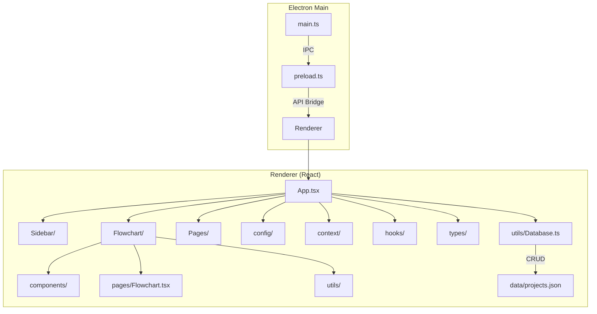
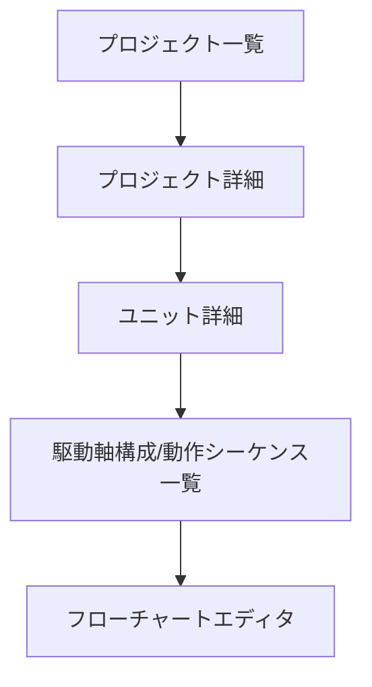
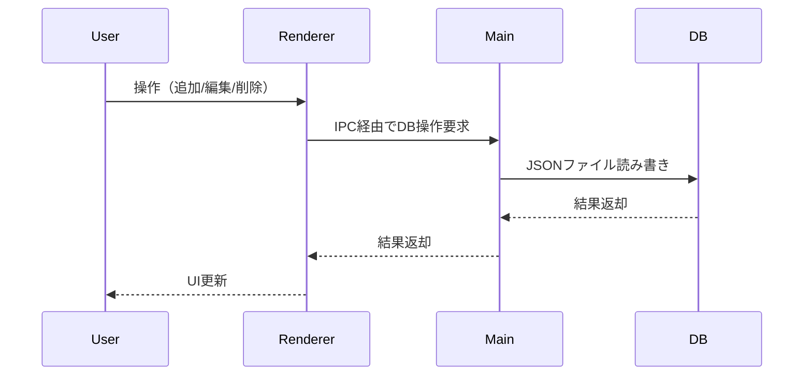

# Mechanical Sequence Design Tool 詳細設計ドキュメント

## 1. はじめに

本プロジェクトは、機械装置の動作設計を支援するElectron+React+TypeScriptベースのデスクトップアプリケーションです。プロジェクト・ユニット・駆動軸構成・動作シーケンスを階層的に管理し、フローチャートによる視覚的な設計・編集を可能にします。

---

## 2. システム全体構成

### 2.1 ディレクトリ構成（ツリー形式・コメント付き）

```
root/
├── assets/                # アイコン・リソース類
│   ├── icon.png           # アプリ用アイコン
│   └── icons/             # 各種サイズのアイコン画像
├── data/                  # 永続データ（JSON）
│   └── projects.json      # プロジェクト・ユニット・構成データ
├── docs/                  # ドキュメント
│   └── design.md          # 設計ドキュメント
├── src/                   # ソースコード
│   ├── __tests__/         # テストコード
│   ├── main/              # Electronメインプロセス
│   │   ├── main.ts        # エントリポイント
│   │   ├── database.ts    # DBアクセス（メイン）
│   │   └── preload.ts     # Rendererとのブリッジ
│   └── renderer/          # フロントエンド（React/TypeScript）
│       ├── App.tsx        # ルートコンポーネント
│       ├── components/    # UI部品
│       │   ├── common/    # 共通モーダル・リスト等
│       │   ├── flowchart/ # フローチャート関連
│       │   │   ├── components/
│       │   │   │   ├── base-nodes/         # ノード共通ロジック
│       │   │   │   ├── detail-nodes/       # 詳細ノード
│       │   │   │   ├── drive-config-nodes/ # 駆動軸構成ノード
│       │   │   │   ├── operation-config-nodes/ # 動作シーケンスノード
│       │   │   │   └── sidebar/            # フローチャート用サイドバー
│       │   └── Sidebar/ # サイドバーUI
│       ├── config/       # モーダル等の設定
│       ├── context/      # グローバル状態
│       ├── hooks/        # カスタムフック
│       ├── pages/        # 各画面
│       ├── styles/       # CSS
│       ├── types/        # 型定義
│       └── utils/        # ユーティリティ・DBアクセス
├── package.json           # パッケージ管理
├── README.md              # プロジェクト説明
└── ...
```

#### 構成の意図

- `src/main/` … Electronメインプロセス。アプリ起動・DBアクセス・メニュー・IPC通信等。
- `src/renderer/` … React/TypeScriptによるフロントエンド。UI・状態管理・ロジック。
- `components/flowchart/` … フローチャート関連のUI・ロジック・ノード定義。
- `data/` … JSONによる永続データ（プロジェクト・ユニット等）。
- `__tests__/` … ユニットテスト。
- `config/` … モーダル等の設定情報。

---

### 2.2 アーキテクチャ図（Mermaid）



## 3. データベース設計

### 3.1 データ構造

- `data/projects.json` に全データをJSONで保存
- 主なエンティティ:
  - **Project**
    - id, name, description, createdAt, updatedAt, units: Unit[]
  - **Unit**
    - id, name, description, parentId, createdAt, updatedAt, driveConfigs: DriveConfig[], operationConfigs: OperationConfig[]
  - **DriveConfig / OperationConfig**
    - id, label, description, createdAt, updatedAt, flow_data: FlowData
  - **FlowData**
    - nodes: Node[]
    - edges: { source: string; target: string }[]
    - viewport: { x: number; y: number; zoom: number }
- 型定義は `src/renderer/types/databaseTypes.ts` 参照

### 3.2 データベースアクセス

- `src/renderer/utils/database.ts` にてDatabaseInterfaceを実装
- CRUD操作は全てインターフェース経由で行い、Electron経由でJSONファイルを更新
- ユニット・構成・シーケンス・フローチャート単位でデータを分離

## 4. NodeDefinitionの詳細

### 4.1 NodeDefinitionの役割

- 各ノードの型・UI・ロジック・初期値・計算処理を定義する
- ファイル例: `components/flowchart/components/detail-nodes/HogeNodeDefinition.tsx`

### 4.2 NodeDefinitionの主な構成

- `type`: ノードタイプ名（例: 'velocityChart'）
- `title`: ノードタイトル（UI表示用）
- `fields`: ノードの入力・表示フィールド配列
  - 各フィールドは `InputFieldDefinition` などで型定義
  - 例: テキスト・数値・セレクト・カスタム・区切り線
- `groupTitles`/`groupDisplayOptions`: フィールドグループのタイトルや表示制御
- `handles`: 入出力ハンドルの有無（target/source）
- `getInitialData`: 初期データ生成関数
- `compute`: データ更新時の計算処理（例: 合計時間の自動計算）

#### フィールド定義例

```ts
fields: [
  {
    key: 'velocity',
    label: '速度',
    type: 'number',
    unit: 'mm/s',
    getValue: (data) => data.velocity,
    setValue: (value, data) => ({ ...data, velocity: value }),
    min: 0,
    max: 1000,
    step: 1,
    required: true,
  },
  // ...他フィールド
];
```

#### NodeDefinition雛形

```ts
const hogeNodeDefinition: NodeDefinition = {
  type: 'hoge',
  title: 'Hogeノード',
  fields: [
    /* ...フィールド定義... */
  ],
  getInitialData: () => ({
    /* ...初期値... */
  }),
  compute: (data, id, update) => {
    /* ...計算処理... */
  },
};
```

### 4.3 ノード追加手順

1. `detail-nodes/` などに `HogeNode.tsx`（UI）と `HogeNodeDefinition.tsx`（定義）を作成
2. `HogeNodeDefinition.tsx` でNodeDefinitionを記述
3. `HogeNode.tsx` で `BaseNode` にdefinitionを構築
4. ノードタイプ一覧に追加（`index.ts`等）
5. サイドバーやノードリストに追加

## 4.4 NodeDefinitionとNodeの記述方法（詳細）

### NodeDefinitionの記述方法

NodeDefinitionは各ノードの「型」「UI」「フィールド」「初期値」「計算ロジック」などを宣言的に定義するオブジェクトです。

#### 1. ファイル配置

- `src/renderer/components/flowchart/components/detail-nodes/` などに `HogeNodeDefinition.tsx` を作成

#### 2. 基本構造

```ts
import { NodeDefinition } from '../base-nodes/types';

const hogeNodeDefinition: NodeDefinition = {
  type: 'hoge', // ノードタイプ名（ユニーク）
  title: 'Hogeノード', // UI上のタイトル
  fields: [
    {
      key: 'param1',
      label: 'パラメータ1',
      type: 'number',
      getValue: (data) => data.param1,
      setValue: (value, data) => ({ ...data, param1: value }),
      min: 0,
      max: 100,
      step: 1,
      required: true,
    },
    // ...他フィールド
  ],
  groupTitles: { parameters: 'パラメータ' }, // グループ表示（任意）
  groupDisplayOptions: { parameters: { showTitle: true } },
  handles: { target: true, source: true }, // 入出力ハンドル
  getInitialData: () => ({ param1: 0 }), // 初期値
  compute: (data, id, update) => {
    // データ変更時の自動計算ロジック（任意）
    if (data.param1 < 0) update({ ...data, param1: 0 });
  },
};

export default hogeNodeDefinition;
```

#### 3. フィールド型の主な種類

- `type: 'number' | 'text' | 'select' | 'custom' | 'readonly' | 'divider' | 'chart'`
- `getValue`, `setValue` で双方向バインド
- `validation` でバリデーション関数も指定可能

#### 4. 計算ロジック

- `compute` 関数で、他フィールドの値に応じた自動計算や副作用を記述可能
- 例: 合計値の自動更新、他フィールドの連動

---

### Node（UIコンポーネント）の記述方法

NodeはNodeDefinitionを受け取り、BaseNodeを使ってUIを構築するReactコンポーネントです。

#### 1. ファイル配置

- `src/renderer/components/flowchart/components/detail-nodes/` などに `HogeNode.tsx` を作成

#### 2. 基本構造

```tsx
import React, { memo } from 'react';
import BaseNode from '../base-nodes/BaseNode';
import hogeNodeDefinition from './HogeNodeDefinition';

const HogeNode = ({ id, data, updateNodeData }) => (
  <BaseNode
    id={id}
    data={data}
    definition={hogeNodeDefinition}
    updateNodeData={updateNodeData}
  />
);

export default memo(HogeNode);
```

#### 3. BaseNodeの役割

- NodeDefinitionに従い、フィールド・グループ・ハンドル・カスタムUIを自動生成
- `updateNodeData` でノードデータの双方向更新
- `readonly` や `renderCustomUI` などの拡張も可能

#### 4. ノードタイプの登録

- ノード一覧（例: `index.ts`）でtypeとコンポーネントを紐付けてエディタに登録

```ts
export const detailNodeTypes = {
  hoge: HogeNode,
  // ...他ノード
};
```

---

## 4.5 NodeDefinition/Nodeの拡張性と応用例

### Handle（入出力ハンドル）の拡張

- `handles` プロパティで target/source の有無や複数ハンドルの制御が可能
- デフォルトは `handles: { target: true, source: true }`
- 複数ハンドルやカスタム位置は `BaseNode` の `renderHandles` プロパティで拡張

#### 例: 複数/カスタムハンドル

```ts
const customNodeDefinition: NodeDefinition = {
  type: 'customNode',
  title: 'カスタムノード',
  fields: [
    {
      key: 'param1',
      label: 'パラメータ1',
      type: 'number',
      getValue: (data) => data.param1,
      setValue: (value, data) => ({ ...data, param1: value }),
      min: 0,
      max: 100,
      step: 1,
      required: true,
    },
    // ...他フィールド
  ],
  getInitialData: () => ({ param1: 0 }),
  compute: (data, id, update) => {
    if (data.param1 < 0) update({ ...data, param1: 0 });
  },
  handles: { target: true, source: true },
};

// Node側でカスタムハンドルを追加
<BaseNode
  id={id}
  data={data}
  definition={customNodeDefinition}
  updateNodeData={updateNodeData}
  renderHandles={(id, data) => (
    <>
      <Handle type="source" position={Position.Left} id="left" />
      <Handle type="source" position={Position.Right} id="right" />
    </>
  )}
/>
```

### カスタムUIの拡張

- `fields` の `type: 'custom'` で任意のReact要素をレンダリング可能
- `customRender`/`render` プロパティで独自UIや複雑な入力・可視化を実装
- `BaseNode` の `renderCustomUI` でノード全体の下部などにカスタムUIを追加可能

#### 例: カスタムフィールド

```ts
fields: [
  {
    key: 'customChart',
    type: 'custom',
    render: (data, update, readonly) => (
      <MyChartComponent value={data.chartData} onChange={v => update({ ...data, chartData: v })} readOnly={readonly} />
    ),
  },
  // ...他フィールド
]
```

#### 例: ノード全体へのカスタムUI

```tsx
<BaseNode
  id={id}
  data={data}
  definition={hogeNodeDefinition}
  updateNodeData={updateNodeData}
  renderCustomUI={(id, data) => (
    <button onClick={() => alert(`ノードID: ${id}`)}>デバッグ</button>
  )}
/>
```

### その他の拡張ポイント

- `readonly` プロパティでフィールド単位の編集可否制御
- `groupTitles`/`groupDisplayOptions` でUIグループ化や装飾
- `validation` で入力値のバリデーション
- `condition`/`hidden` でフィールドの動的表示制御
- `chart`型フィールドでグラフや可視化も可能

### 実装・運用上の注意

- 拡張はNodeDefinition/Node/Fieldの各レイヤで柔軟に可能
- 複雑なUIやロジックはカスタムフィールドや `renderCustomUI` で分離
- ノード間の依存や連動は `compute` で集約
- 型定義を活用し、拡張時も型安全性を維持

## 5. UI/UX設計

### 5.1 画面遷移図（Mermaid）



### 5.2 主要UI部品

- サイドバー: プロジェクト・ユニット・構成を階層表示
- モーダル: 新規作成・編集・削除
- フローチャート: ノード・エッジのD&D、再接続、編集
- スタイル: `styles/` 配下CSSで統一

#### サイドバー構造

- `Sidebar/Sidebar.tsx` … サイドバー本体
- `Sidebar/items/` … ユニット・構成・カテゴリ等のリスト部品
- `Sidebar/ProjectContent.tsx` … プロジェクト・ユニット階層の表示ロジック

#### モーダル構造

- `common/BaseModal.tsx` … 汎用モーダル
- `common/FormModal.tsx` … 入力フォーム付きモーダル
- `config/modalConfigs.ts` … モーダルのフィールド・バリデーション定義

#### フローチャート構造

- `flowchart/pages/Flowchart.tsx` … フローチャート画面本体
- `flowchart/components/` … ノード・サイドバー・ツールバー等
- `flowchart/components/base-nodes/` … ノード共通ロジック
- `flowchart/components/detail-nodes/` … 詳細ノード
- `flowchart/components/drive-config-nodes/` … 駆動軸構成用ノード
- `flowchart/components/operation-config-nodes/` … 動作シーケンス用ノード
- `flowchart/styles/` … フローチャート用CSS

#### スタイルガイド

- `styles/App.css` … 全体レイアウト
- `styles/Common.css` … 汎用スタイル
- `flowchart/styles/common.css` … ノード・フローチャート共通
- `flowchart/styles/flow-theme.css` … テーマ・色・ノード装飾

---

### 6. 機能詳細設計

### 6.1 プロジェクト・ユニット管理

- 一覧・新規作成・編集・削除
- サブユニット（階層構造）対応
- サイドバーでの階層表示

### 6.2 駆動軸構成・動作シーケンス管理

- 各ユニットに複数の構成・シーケンスを紐付け
- フローチャートデータ（ノード・エッジ）を個別に保持

### 6.3 フローチャート編集

- ノード追加/削除/編集、エッジ追加/削除/再接続
- ノードは「Node.tsx」と「NodeDefinition.tsx」の2ファイルで構成
- ノードの雛形例・追加手順は前述

### 6.4 モーダル・フォーム

- 共通モーダル (`BaseModal.tsx`, `FormModal.tsx`)
- モーダル設定は `config/modalConfigs.ts` で一元管理

### 6.5 駆動軸構成ノード（drive-config-nodes）の設計詳細

#### データ構造と設計方針

- すべての駆動軸構成ノードは `DriveNodeData` を継承し、`outputSpec` プロパティを持つ。
- `outputSpec` は「回転系出力（rotational）」または「直動系出力（linear）」、または両方を持つことができる。
- 各ノードは「入力値（ユーザーが指定するパラメータ）」と「出力値（計算・伝播されるスペック）」を明確に分離する。
- 型定義・データ構造は `src/renderer/types/databaseTypes.ts` で一元管理。

##### 回転系出力（rotational）で保持・計算する値

- 定格トルク（Rated Torque）
- 定格回転速度（Rated Speed）
- 定格出力（Rated Power）
- 最大トルク（Max Torque）
- 最大回転速度（Max Speed）
- 最大出力（Max Power）
- 許容トルク（Allowable Torque）
- 全体の減速比（Total Gear Ratio）
- 全体の慣性モーメント（Total Inertia）

##### 直動系出力（linear）で保持・計算する値

- 定格推力（Rated Force）
- 定格速度（Rated Speed）
- 定格出力（Rated Power）
- 最大推力（Max Force）
- 最大速度（Max Speed）
- 最大出力（Max Power）
- ストローク（Stroke）
- 最大加速度（Max Acceleration）

##### 共通で保持する値

- 効率（Efficiency）

---

#### ノード種別ごとの入力・出力仕様

| ノード種別         | 主な入力値                                                             | 主な出力値               |
| :----------------- | :--------------------------------------------------------------------- | :----------------------- |
| 回転アクチュエータ | 型式、メーカー、定格トルク、定格速度、最大速度、ローター慣性モーメント | 回転系出力（rotational） |
| 直動アクチュエータ | 型式、メーカー、ストローク長さ、定格推力、定格速度、最大速度、加速度   | 直動系出力（linear）     |
| 回転→回転変換      | 型式、メーカー、効率、減速比/増速比、慣性モーメント、最大トルク        | 回転系出力（rotational） |
| 回転→直動変換      | 型式、メーカー、効率、リード/ピッチ、変換比、最大推力、最大速度        | 直動系出力（linear）     |
| 直動→回転変換      | 型式、メーカー、効率、変換比、最大トルク                               | 回転系出力（rotational） |
| 直動→直動変換      | 型式、メーカー、効率、変換比、最大推力                                 | 直動系出力（linear）     |
| 出力ノード         | なし（入力値なし、前段の出力値を表示）                                 | 回転系または直動系出力   |

---

#### 運用フロー・ノード種別の使い分け

- 構想段階では仕様のみを入力するノードも利用可能。
- 詳細設計段階では「駆動部品登録ページ」で部品（型式・メーカー・スペック）を登録し、フローチャートで型式選択してノード追加。
- 出力ノードは入力値を持たず、前段の出力値（最終スペック）を表示するだけ。

---

#### 計算ロジック・データ伝播のポイント

- 各ノードは、入力値と前段ノードの出力値（outputSpec）をもとに、自身の `outputSpec` を計算する。
- 変換ノード（例：減速機、ボールねじ等）は、入力値（効率・変換比など）と前段の出力値を組み合わせて新たな出力値を算出。
- 効率や減速比などは、ノードチェーン全体で累積的に計算される。
- 計算式や伝播ロジックは `compute` 関数に集約し、型安全性を担保。
- 例：減速機ノードでは、前段のトルク・回転数・慣性モーメントを減速比・効率で変換し、次段へ伝播。

---

#### 拡張性・保守性への配慮

- ノード追加時は「入力値」「出力値（outputSpec）」「計算ロジック（compute）」を定義するだけで拡張可能。
- 型定義・共通ロジックを活用し、ノード間のデータ受け渡し・計算式の一貫性を維持。
- 新たな物理量や出力値が必要な場合も、型定義・NodeDefinitionの拡張で柔軟に対応。
- UI上は、出力値（outputSpec）をreadonlyフィールドやカスタムUIで明示的に表示。

---

#### 実装例（抜粋）

```ts
// 型定義例（databaseTypes.ts）
export interface RotationalOutput {
  ratedTorque: number;
  ratedSpeed: number;
  ratedPower: number;
  maxTorque: number;
  maxSpeed: number;
  maxPower: number;
  allowableTorque?: number;
  totalGearRatio?: number;
  totalInertia?: number;
  efficiency?: number;
}

export interface LinearOutput {
  ratedForce: number;
  ratedSpeed: number;
  ratedPower: number;
  maxForce: number;
  maxSpeed: number;
  maxPower: number;
  stroke?: number;
  maxAcceleration?: number;
  efficiency?: number;
}

export interface DriveNodeData {
  // ...入力値...
  outputSpec?: RotationalOutput | LinearOutput;
}
```

---

この設計により、駆動軸構成ノードは物理量の伝播・変換・集約を柔軟かつ型安全に実現できる。ノード追加や仕様拡張も最小限の変更で対応可能。

---

## 7. データフロー・状態管理

### 7.1 データフロー図（Mermaid）



### 7.2 状態管理

- ReactのuseState/useContextでグローバル状態管理
- フローチャートのノード・エッジはuseStateで管理
- データ永続化はDBインターフェース経由

---

## 8. テスト設計

- ユニットテストは `__tests__/` 配下
- 主要なCRUD・フローチャート操作・ノード追加/削除/編集のテストを実施
- テスト例:
  - プロジェクト作成・削除
  - ユニット階層構造
  - ノード追加・編集・削除
  - フローチャート保存・復元

---

## 9. 拡張性・保守性

- ノード追加は定型的な2ファイル追加で拡張容易
- 型安全なデータモデル
- データベース層はインターフェース経由で疎結合
- UI部品は再利用性を重視
- スタイル・設定・ロジックの分離

---

## 10. 今後の課題・TODO

- タクトタイム計算機能の拡充
- Undo/Redoの実装
- テストケースの拡充
- ドキュメントの充実
