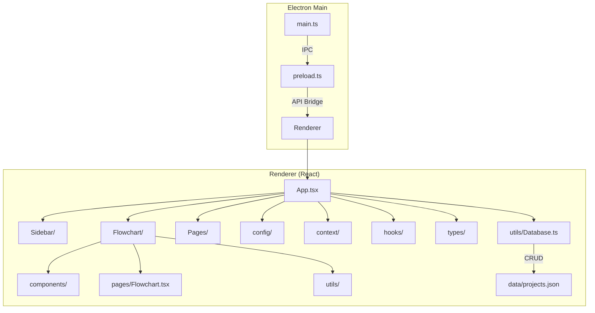
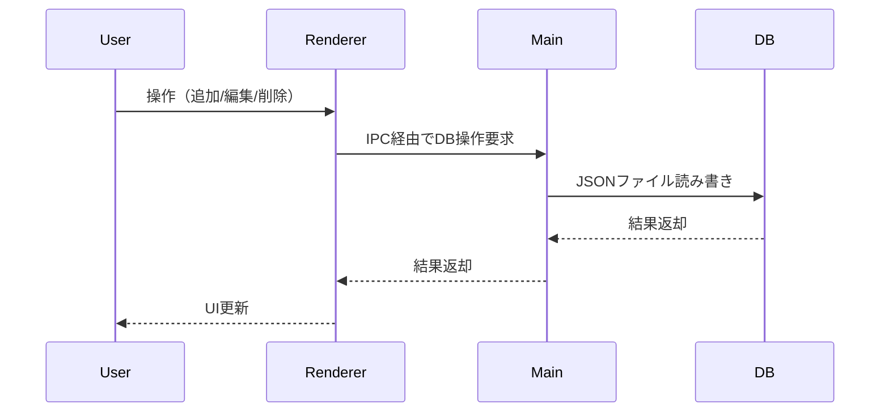
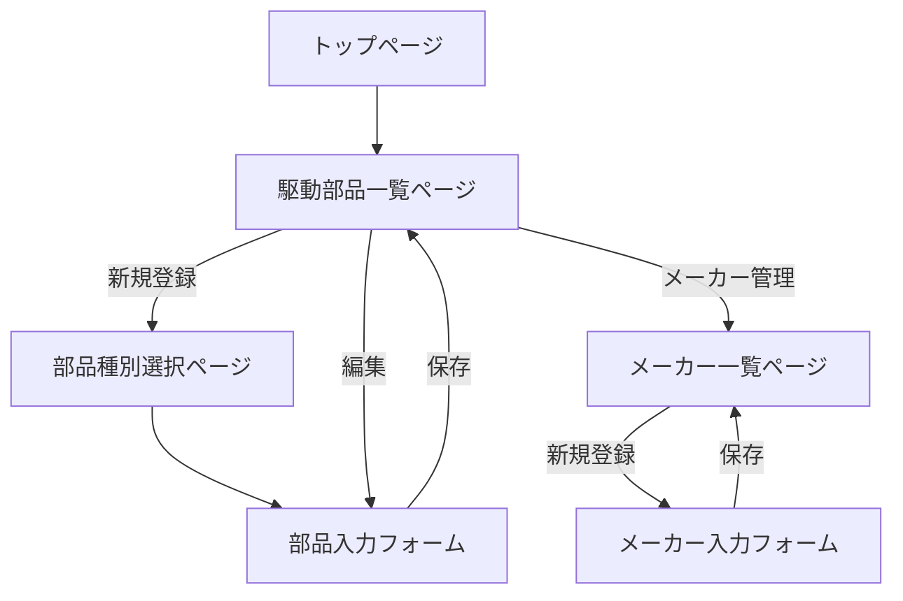

# Mechanical Sequence Design Tool 詳細設計ドキュメント

## 1. はじめに

本プロジェクトは、機械装置の動作設計を支援するElectron+React+TypeScriptベースのデスクトップアプリケーションです。プロジェクト・ユニット・駆動軸構成・動作シーケンスを階層的に管理し、フローチャートによる視覚的な設計・編集を可能にします。

- 想定ユーザー: 機械設計者、設備設計エンジニア
- 主なユースケース: 機械装置の駆動系構成検討、動作シーケンス設計、部品選定、仕様検証
- 主要機能: 階層管理、フローチャート編集、部品DB連携、計算・伝播、設計データの永続化

---

## 2. システム全体構成

### 2.1 ディレクトリ構成（ツリー形式・コメント付き）

- assets/: アイコン・リソース類
- data/: 永続データ（JSON）
- docs/: ドキュメント
- src/: ソースコード（main: Electronメイン/ renderer: Reactフロント）
- release/: ビルド成果物

#### 主要ファイル・ディレクトリの役割

- src/main/: Electronメインプロセス（DBアクセス、IPC、メニュー等）
- src/renderer/: React/TypeScriptフロントエンド
  - components/flowchart/: フローチャートUI・ノード定義
  - components/Sidebar/: サイドバーUI
  - config/: モーダル等の設定
  - context/: グローバル状態
  - hooks/: カスタムフック
  - pages/: 各画面
  - types/: 型定義
  - utils/: DBアクセス・ユーティリティ

---

### 2.2 アーキテクチャ図



---

## 2.3 スタイル（CSS）管理方針

- すべてのCSSファイルは `src/renderer/styles/` ディレクトリに集約し、UI全体のスタイルを一元管理する
- ディレクトリ例:
  ```
  src/renderer/styles/
    App.css              // アプリ全体のベースレイアウト
    Common.css           // 汎用レイアウト・ボタン・リスト・フォーム等
    Modal.css            // モーダル・フォーム共通
    FlowchartTheme.css   // フローチャート系
    Sidebar.css          // サイドバー固有
    TitleBar.css         // タイトルバー固有
  ```
- ファイル分割方針:
  - 汎用的なクラス（.container, .actions, .loading, .error, .form-group など）は Common.css に集約する
  - モーダル・フォームは Modal.css、フローチャートは FlowchartTheme.css に分離する
  - Sidebar/TitleBarなどUI固有のスタイルのみ個別ファイルで管理する
  - 新規UI追加時もまず styles/ 配下を参照し、共通クラスを再利用する
- 運用ルール:
  - 重複・細分化を避け、共通化できるものは都度 Common.css へ吸収する
  - 変数（色・余白等）は :root で一元管理する

---

## 3. データベース設計（詳細）

### 3.1 データベース設計方針

- データベース層はインターフェイスによる抽象化を徹底し、ストレージ方式（JSONファイル/SQLite/サーバDB等）の違いを吸収し、柔軟な拡張・切替を可能とする。
- すべてのデータアクセスは `DatabaseInterface` を通じて行い、UIやロジック層はストレージ方式に依存しない。
- データベースの具体的な実装（JsonDatabase, SQLiteDatabase, ServerDatabase等）はFactoryパターンで生成し、必要に応じてキャッシュ層（CachedDatabase）を挟む。

### 3.2 DatabaseFactoryと切替設計

DatabaseFactoryクラスは、アプリケーション設定(config.databaseType等)に応じて適切なDatabaseInterface実装を生成する。サポートするストレージ方式は以下の通り。

- 'json': JsonDatabase（ローカルJSONファイルを用いる実装）
- 'sqlite': SQLiteDatabase（ローカルSQLite DBを用いる実装）
- 'server': ServerDatabase（API/クラウドDB等を用いる実装）

DatabaseFactoryは静的メソッドcreateDatabase()を持ち、config.databaseTypeの値に応じて下記のようにインスタンスを生成する。生成したDatabaseInterface実装は必ずCachedDatabaseでラップして返す。新たなストレージ方式を追加する場合は、DatabaseInterface実装を追加し、switch文にcaseを追加する。

設計仕様:

- DatabaseFactoryはsrc/renderer/utils/DatabaseFactory.tsに実装する。
- DatabaseFactoryは下記のような構造とする。

```typescript
import { DatabaseInterface } from '@/renderer/types/databaseTypes';
import { JsonDatabase } from '@/renderer/utils/database';
import { SQLiteDatabase } from '@/renderer/utils/sqliteDatabase';
import { ServerDatabase } from '@/renderer/utils/serverDatabase';
import { config } from '@/renderer/config';
import CachedDatabase from '@/renderer/utils/CachedDatabase';

class DatabaseFactory {
  static createDatabase(): DatabaseInterface {
    let database: DatabaseInterface;
    switch (config.databaseType) {
      case 'json':
        database = new JsonDatabase('projects.json');
        break;
      case 'sqlite':
        database = new SQLiteDatabase('projects.db');
        break;
      case 'server':
        database = new ServerDatabase(config.serverEndpoint);
        break;
      default:
        throw new Error('Unsupported database type');
    }
    return new CachedDatabase(database);
  }
}
export default DatabaseFactory;
```

- JsonDatabaseはローカルのJSONファイルを読み書きする実装とする。
- SQLiteDatabaseはローカルのSQLiteファイルDBを操作する実装とする。
- ServerDatabaseはREST APIやGraphQL等のサーバDBを操作する実装とする。
- すべてのDatabaseInterface実装は、プロジェクト・ユニット・構成・シーケンス等のCRUD、トランザクション、ID発番等のメソッドを持つ。
- CachedDatabaseは、DatabaseInterfaceをラップし、読み込み結果のキャッシュや多重アクセス時の整合性を担保する。
- 設定値（config.databaseType, config.serverEndpoint等）はアプリケーションの設定ファイルで管理する。

---

## 3.3 DatabaseInterfaceの設計

DatabaseInterfaceは、プロジェクト・ユニット・駆動軸構成・動作シーケンス・フローチャートデータなど、全てのエンティティに対するCRUD操作、検索、ID発番、トランザクション制御を型安全に提供するインターフェイスとする。

```typescript
export interface DatabaseInterface {
  // プロジェクト管理
  getProjects(): Promise<Project[]>;
  getProjectById(projectId: string): Promise<Project | undefined>;
  addProject(project: Project): Promise<void>;
  updateProject(project: Project): Promise<void>;
  deleteProject(projectId: string): Promise<void>;

  // ユニット管理
  getUnits(projectId: string): Promise<Unit[]>;
  getUnitById(projectId: string, unitId: string): Promise<Unit | undefined>;
  addUnit(projectId: string, unit: Unit): Promise<void>;
  updateUnit(projectId: string, unit: Unit): Promise<void>;
  deleteUnit(projectId: string, unitId: string): Promise<void>;

  // 駆動軸構成管理
  getDriveConfigs(unitId: string): Promise<DriveConfig[]>;
  getDriveConfigById(
    unitId: string,
    configId: string,
  ): Promise<DriveConfig | undefined>;
  addDriveConfig(unitId: string, config: DriveConfig): Promise<void>;
  updateDriveConfig(unitId: string, config: DriveConfig): Promise<void>;
  deleteDriveConfig(unitId: string, configId: string): Promise<void>;

  // 動作シーケンス管理
  getOperationConfigs(unitId: string): Promise<OperationConfig[]>;
  getOperationConfigById(
    unitId: string,
    configId: string,
  ): Promise<OperationConfig | undefined>;
  addOperationConfig(unitId: string, config: OperationConfig): Promise<void>;
  updateOperationConfig(unitId: string, config: OperationConfig): Promise<void>;
  deleteOperationConfig(unitId: string, configId: string): Promise<void>;

  // フローチャートデータ管理
  getFlowData(configId: string): Promise<FlowData>;
  updateFlowData(configId: string, flowData: FlowData): Promise<void>;

  // ID発番
  generateId(prefix: string): string;

  // トランザクション制御
  beginTransaction(): Promise<void>;
  commitTransaction(): Promise<void>;
  rollbackTransaction(): Promise<void>;

  // 部品管理
  getParts(type?: string): Promise<DrivePart[]>;
  getPartById(id: string): Promise<DrivePart | undefined>;
  addPart(part: DrivePart): Promise<void>;
  updatePart(part: DrivePart): Promise<void>;
  deletePart(id: string): Promise<void>;

  // メーカー管理
  getManufacturers(): Promise<Manufacturer[]>;
  getManufacturerById(id: string): Promise<Manufacturer | undefined>;
  addManufacturer(mfr: Manufacturer): Promise<void>;
  updateManufacturer(mfr: Manufacturer): Promise<void>;
  deleteManufacturer(id: string): Promise<void>;
}
```

---

## 4. NodeDefinitionの詳細

### 4.1 NodeDefinitionの役割

- 各ノードの型・UI・ロジック・初期値・計算処理を定義する
- ファイル例: `components/flowchart/components/detail-nodes/HogeNodeDefinition.tsx`
- 主要プロパティ:
  - type: ノードタイプ名（例: 'velocityChart'）
  - title: ノードタイトル（UI表示用）
  - fields: 入力・表示フィールド配列（InputFieldDefinition型）
  - handles: 入出力ハンドルの有無
  - getInitialData: 初期データ生成関数
  - compute: データ更新時の計算処理

### 4.2 NodeDefinitionの主な構成・型定義

```typescript
export interface NodeDefinition {
  type: string;
  title: string;
  fields: InputFieldDefinition[];
  handles?: { target?: boolean; source?: boolean };
  groupTitles?: { [groupKey: string]: string };
  groupDisplayOptions?: { [groupKey: string]: { showTitle?: boolean } };
  getInitialData: () => any;
  compute?: (data: any, id: string, update: (d: any) => void) => void;
  renderCustomUI?: (id: string, data: any) => React.ReactNode;
}

export interface InputFieldDefinition {
  key: string;
  label: string;
  type:
    | 'number'
    | 'text'
    | 'select'
    | 'custom'
    | 'readonly'
    | 'divider'
    | 'chart';
  unit?: string;
  getValue: (data: any) => any;
  setValue: (value: any, data: any) => any;
  min?: number;
  max?: number;
  step?: number;
  required?: boolean;
  options?: { label: string; value: any }[];
  render?: (
    data: any,
    update: (v: any) => void,
    readonly: boolean,
  ) => React.ReactNode;
  readonly?: boolean;
  validation?: (value: any) => string | undefined;
  group?: string;
  condition?: (data: any) => boolean;
  hidden?: boolean;
}
```

### 4.3 仕様補足・拡張

- 各ノードの初期データ生成は getInitialData で統一し、useNodeInitialData フックにより初期化処理を共通化する。
- propagateFields プロパティで、前段ノードから特定フィールド（例: outputSpec など）を自動伝播できる。BaseNode がこの伝播処理を共通で担う。

---

## 5. UI/UX設計

### 5.1 画面構成・主要UI部品

各UI部品は、props・状態・イベント・構造・バリデーション・エラー表示・スタイルを詳細に設計する。

### サイドバー

- 階層構造でプロジェクト・ユニット・構成を表示
- props: projects: Project[], selectedProjectId: string, onSelectProject: (id: string) => void, ...
- 状態: 開閉状態、選択状態、ドラッグ&ドロップ状態
- イベント: プロジェクト選択、ユニット追加/削除、構成選択、ドラッグ&ドロップ
- スタイル: Sidebar.cssで定義

### フローチャート

- ノード・エッジのD&D、再接続、編集、ズーム、パン
- props: nodes: Node[], edges: Edge[], onNodeChange: (nodes: Node[]) => void, onEdgeChange: (edges: Edge[]) => void, ...
- 状態: 選択ノード、編集中ノード、ズーム倍率、パン位置
- イベント: ノード追加/削除/編集、エッジ追加/削除/再接続、ノード移動
- スタイル: flow-theme.css, common.css

### モーダル

- 新規作成・編集・削除用のBaseModal, FormModal
- props: isOpen: boolean, onClose: () => void, fields: InputFieldDefinition[], onSubmit: (data: any) => void, ...
- バリデーション: 各フィールドのrequired, min, max, validation関数で制御
- エラー表示: フィールド単位でエラー文言を表示
- スタイル: BaseModal.css, FormModal.css

- 画面遷移例:
  - プロジェクト一覧 → プロジェクト詳細 → ユニット詳細 → 構成/シーケンス一覧 → フローチャートエディタ

### 5.2 UI状態・バリデーション例

- 各フォームはバリデーション（必須・型・範囲）を実装
- 例: モーダルでの入力値チェック、エラー表示

### 5.3 サイドバー・フローチャート拡張仕様

- サイドバーは shouldAutoOpen/shouldAutoPin 判定により自動で展開・ピン留めされる。状態変化時は sidebar-change カスタムイベントを発火し、外部からも状態監視が可能。
- サイドバーのアイコン並び替え・D&Dは useSidebarDragDrop カスタムフックで実装し、Sidebar のロジックから分離・再利用性を高めている。

---

### 5.4 スタイル設計・運用指針

- 各UI部品のスタイルは、共通クラスと個別クラスを明確に分離する
- 例: サイドバーは Sidebar.css、フローチャートは FlowchartTheme.css、フォームは Modal.css に記述する
- レイアウト・ボタン・リスト・エラーメッセージ等は Common.css のクラスを全画面で再利用する
- スタイルの拡張・カスタマイズは styles/ 配下の該当ファイルに追記する
- 細かく切り分けすぎず、同じ見た目・機能のものは必ず共通クラスを使う
- 例: 表（リスト）のヘッダーと要素行で同じスタイルを重複定義しない

---

## 6. 機能詳細設計

### 6.1 プロジェクト・ユニット管理

- 一覧・新規作成・編集・削除
- サブユニット（階層構造）対応
- サイドバーでの階層表示
- 操作フロー例:
  1. プロジェクト新規作成
  2. ユニット追加
  3. 構成・シーケンス追加
  4. フローチャート編集

### 6.2 駆動軸構成・動作シーケンス管理

- 各ユニットは複数の駆動軸構成（DriveConfig）・動作シーケンス（OperationConfig）を持つ。
- DriveConfig/OperationConfigはCRUD操作で管理し、各操作はDatabaseInterface経由で行う。
- 型定義:

```typescript
export interface DriveConfig {
  id: string;
  label: string;
  description?: string;
  createdAt: string;
  updatedAt: string;
  flowData: FlowData;
}
export interface OperationConfig {
  id: string;
  label: string;
  description?: string;
  createdAt: string;
  updatedAt: string;
  flowData: FlowData;
}
```

- CRUD操作:
  - addDriveConfig(unitId: string, config: DriveConfig): Promise<void>
  - updateDriveConfig(unitId: string, config: DriveConfig): Promise<void>
  - deleteDriveConfig(unitId: string, configId: string): Promise<void>
  - addOperationConfig(unitId: string, config: OperationConfig): Promise<void>
  - updateOperationConfig(unitId: string, config: OperationConfig): Promise<void>
  - deleteOperationConfig(unitId: string, configId: string): Promise<void>
- 各操作はUIイベント（追加・編集・削除ボタン等）から呼び出され、DB更新後は状態を再取得してUIを更新する。

### 6.3 フローチャート編集

- ノード追加: サイドバーやツールバーからノードタイプを選択し、フローチャート上に配置する。ノードIDはgenerateIdで発番。
- ノード編集: ノードクリックで詳細パネルまたはモーダルを開き、NodeDefinitionに従い編集。編集内容は即時反映または保存時にDBへ反映。
- ノード削除: ノード選択後、削除ボタンで削除。関連エッジも自動削除。
- エッジ追加/削除/再接続: ノード間をドラッグで接続、エッジ選択で削除、再接続もD&Dで実装。
- ノード間のデータ伝播・計算は各NodeDefinitionのcompute関数で一元管理し、依存関係がある場合は再計算をトリガーする。
- フローチャートの状態（ノード・エッジ・ビュー）はFlowData型で管理し、DBに永続化する。

### 6.4 モーダル・フォーム

- モーダルはBaseModal, FormModalで実装し、propsでisOpen, onClose, fields, onSubmit等を受け取る。
- 各フィールドはInputFieldDefinitionで定義し、required, min, max, validation関数でバリデーションを実装。
- バリデーションエラーはフィールド単位でエラー文言を表示し、onSubmit時に全フィールド検証を行う。
- 入力値はuseStateで管理し、変更時に即時バリデーションを実行。
- スタイル・レイアウトはFormModal.css, BaseModal.cssで統一。

### 6.5 駆動軸構成ノードの設計詳細

#### データ構造と設計方針

- すべての駆動軸構成ノードは `DriveNodeData` を継承し、`outputSpec` プロパティを持つ。
- `outputSpec` は「回転系出力（rotational）」または「直動系出力（linear）」、または両方を持つことができる。
- 各ノードは「入力値（ユーザーが指定するパラメータ）」と「出力値（計算・伝播されるスペック）」を明確に分離する。
- 型定義・データ構造は `src/renderer/types/databaseTypes.ts` で一元管理。

##### 回転系出力（rotational）で保持・計算する値

- 定格トルク（Rated Torque）
- 定格回転速度（Rated Speed）
- 定格出力（Rated Power）
- 最大トルク（Max Torque）
- 最大回転速度（Max Speed）
- 最大出力（Max Power）
- 許容トルク（Allowable Torque）
- 全体の減速比（Total Gear Ratio）
- 全体の慣性モーメント（Total Inertia）

##### 直動系出力（linear）で保持・計算する値

- 定格推力（Rated Force）
- 定格速度（Rated Speed）
- 定格出力（Rated Power）
- 最大推力（Max Force）
- 最大速度（Max Speed）
- 最大出力（Max Power）
- ストローク（Stroke）
- 最大加減速度（Max Acceleration）

##### 共通で保持する値

- 効率（Efficiency）

---

#### ノード種別ごとの入力・出力仕様

| ノード種別         | 主な入力値                                                                           | 主な出力値               |
| :----------------- | :----------------------------------------------------------------------------------- | :----------------------- |
| 回転アクチュエータ | 型式、メーカー、定格トルク、定格速度、最大トルク、最大速度、ローター慣性モーメント   | 回転系出力（rotational） |
| 直動アクチュエータ | 型式、メーカー、ストローク長さ、定格推力、定格速度、最大推力、最大速度、最大加減速度 | 直動系出力（linear）     |
| 回転→回転変換      | 型式、メーカー、効率、減速比、慣性モーメント、許容トルク                             | 回転系出力（rotational） |
| 回転→直動変換      | 型式、メーカー、効率、リード/ピッチ、変換比、許容推力                                | 直動系出力（linear）     |
| 直動→回転変換      | 型式、メーカー、効率、変換比、許容トルク                                             | 回転系出力（rotational） |
| 直動→直動変換      | 型式、メーカー、効率、変換比、許容推力                                               | 直動系出力（linear）     |
| 出力ノード         | なし（入力値なし、前段の出力値を表示）                                               | 回転系または直動系出力   |

---

#### 運用フロー・ノード種別の使い分け

- 構想段階では仕様のみを入力するノードも利用可能。
- 詳細設計段階では「駆動部品登録ページ」で部品（型式・メーカー・スペック）を登録し、フローチャートで型式選択してノード追加。
- 出力ノードは入力値を持たず、前段の出力値（最終スペック）を表示するだけ。

---

#### 計算ロジック・データ伝播のポイント

- 各ノードは、入力値と前段ノードの出力値（outputSpec）をもとに、自身の `outputSpec` を計算する。
- 変換ノード（例：減速機、ボールねじ等）は、入力値（効率・変換比など）と前段の出力値を組み合わせて新たな出力値を算出。
- 効率や減速比などは、ノードチェーン全体で累積的に計算される。
- 計算式や伝播ロジックは `compute` 関数に集約し、型安全性を担保。
- 例：減速機ノードでは、前段のトルク・回転数・慣性モーメントを減速比・効率で変換し、次段へ伝播。

---

#### 拡張性・保守性への配慮

- ノード追加時は「入力値」「出力値（outputSpec）」「計算ロジック（compute）」を定義するだけで拡張可能。
- 型定義・共通ロジックを活用し、ノード間のデータ受け渡し・計算式の一貫性を維持。
- 新たな物理量や出力値が必要な場合も、型定義・NodeDefinitionの拡張で柔軟に対応。
- UI上は、出力値（outputSpec）をreadonlyフィールドやカスタムUIで明示的に表示。

---

#### 実装例（抜粋）

```ts
// 型定義例（databaseTypes.ts）
export interface RotationalOutput {
  ratedTorque: number;
  ratedSpeed: number;
  ratedPower: number;
  maxTorque: number;
  maxSpeed: number;
  maxPower: number;
  allowableTorque?: number;
  totalGearRatio?: number;
  totalInertia?: number;
  efficiency?: number;
}

export interface LinearOutput {
  ratedForce: number;
  ratedSpeed: number;
  ratedPower: number;
  maxForce: number;
  maxSpeed: number;
  maxPower: number;
  stroke?: number;
  maxAcceleration?: number;
  efficiency?: number;
}

export interface DriveNodeData {
  // ノードごとの入力値を全て明記
  outputSpec?: RotationalOutput | LinearOutput;
}
```

### 6.6 駆動軸構成ノードの共通仕様

- 駆動軸構成ノードの出力値（outputSpec）は OutputSpecFields.ts で共通定義し、各ノード定義で再利用する。
- 数値フィールドは displayDigits プロパティで丸め桁数を指定でき、UI表示時に適用される。
- 出力仕様のデフォルト値を取得する関数を用意し、ノード初期化やリセット時に利用する。

---

この設計により、駆動軸構成ノードは物理量の伝播・変換・集約を柔軟かつ型安全に実現できる。ノード追加や仕様拡張も最小限の変更で対応可能。

---

## 7. データフロー・状態管理

### 7.1 データフロー図・状態遷移



### 7.2 状態管理の詳細設計

- ReactのuseState/useContextでグローバル状態管理
- 主要なグローバル状態の型例:

```ts
interface GlobalState {
  selectedProjectId?: string;
  selectedUnitId?: string;
  sidebarOpen: boolean;
  // ...
}
```

- フローチャートのノード・エッジはuseStateで管理
- データ永続化はDBインターフェース経由

- グローバル状態はuseContextで管理し、型定義はGlobalStateで厳密に定義。
- ローカル状態はuseStateで管理。
- 状態遷移はUIイベント（選択・追加・編集・削除等）ごとに明確に定義。
- 型定義:

```typescript
export interface GlobalState {
  selectedProjectId?: string;
  selectedUnitId?: string;
  selectedConfigId?: string;
  sidebarOpen: boolean;
  modalState: {
    isOpen: boolean;
    modalType?: string;
    modalProps?: any;
  };
}
```

- 状態変更は必ずsetStateまたはdispatch経由で行い、直接変更は禁止。
- 状態の初期化・リセット・永続化も明記。

---

## 8. テスト設計

- ユニットテストは `__tests__/` 配下
- 主要なCRUD・フローチャート操作・ノード追加/削除/編集のテストを実施
- テストケース例:
  - プロジェクト作成・削除
  - ユニット階層構造
  - ノード追加・編集・削除
  - フローチャート保存・復元
- テストデータ例:

```ts
const testProject: Project = {
  id: 'project-001',
  name: 'テストプロジェクト',
  description: 'テスト用プロジェクト',
  createdAt: '2025-05-03T00:00:00Z',
  updatedAt: '2025-05-03T00:00:00Z',
  units: [],
};
```

- テスト対象は全ての主要機能（CRUD、フローチャート編集、ノード追加/削除/編集、バリデーション、状態遷移、DBアクセス等）とする。
- テスト観点ごとにテストケースを網羅し、テストデータは型定義に準拠。
- テスト手順:
  1. 初期状態の検証
  2. CRUD操作の検証（追加・編集・削除・取得）
  3. UIイベント（ノード追加/削除/編集、エッジ操作、バリデーション）の検証
  4. 状態遷移・永続化の検証
  5. エラーケース・例外処理の検証
- テストコードは**tests**配下に配置し、テストごとに独立したテストデータを用意する。
- すべてのテストは自動化し、CI/CDで定期的に実行する。

---

## 9. 拡張性・保守性

- ノード追加は定型的な2ファイル追加で拡張容易
- 型安全なデータモデル
- データベース層はインターフェース経由で疎結合
- UI部品は再利用性を重視
- スタイル・設定・ロジックの分離
- 拡張手順例:
  1. 型定義追加
  2. NodeDefinition/Node追加
  3. サイドバー・リストに登録

---

## 9.2 スタイルの拡張性・保守性

- スタイルの共通化・一元管理により、UI追加・変更時の影響範囲を最小化できる
- 新規UIやテーマ追加時も styles/ 配下の既存ファイルを拡張・再利用することで保守性を高める
- 共通クラスの拡張・吸収を継続し、冗長な定義や細分化を防ぐ運用を徹底する

---

## 10. 駆動部品登録ページ 詳細設計

### 10.1 概要

駆動部品（アクチュエータ・変換機構等）の型式・メーカー・スペックをグローバルに一元管理するページを実装します。型式＋メーカーで重複を防止し、メーカーは事前登録制（日本語・英語表記の重複も防止）とします。

- グローバル管理（全プロジェクト共通で利用可能）
- 一元管理された部品情報をフローチャート設計時に部品選択可能
- 将来的な検索・フィルタ・インポート/エクスポート・権限・履歴管理の拡張性を確保

### 10.2 画面遷移図



### 10.3 データ構造

#### 10.3.1 メーカー

```typescript
export interface Manufacturer {
  id: string;
  nameJa: string;
  nameEn: string;
  createdAt: string;
  updatedAt: string;
}
```

#### 10.3.2 駆動部品

```typescript
export interface DrivePart {
  id: string;
  type: string; // ノード種別（例: 'rotationalActuator'）
  model: string;
  manufacturerId: string;
  spec: any; // NodeDefinition.fieldsに準拠した入力値
  createdAt: string;
  updatedAt: string;
}
```

#### 10.3.3 データベース全体構造

```typescript
export interface PartsDatabase {
  parts: DrivePart[];
  manufacturers: Manufacturer[];
}
```

### 10.4 スペック型定義

ノード種別ごとに異なるスペックを型安全に定義します。これらは6.5節で定義した出力仕様と一致しています。

```typescript
// 回転アクチュエータ用スペック例
export interface RotationalActuatorSpec {
  ratedTorque: number;
  ratedSpeed: number;
  maxTorque: number;
  maxSpeed: number;
  rotorInertia: number;
  // ...他必要項目
}

// 直動アクチュエータ用スペック例
export interface LinearActuatorSpec {
  stroke: number;
  ratedForce: number;
  ratedSpeed: number;
  maxForce: number;
  maxSpeed: number;
  maxAcceleration: number;
  // ...他必要項目
}
```

### 10.5 DatabaseInterface拡張

既存のDatabaseInterfaceを拡張し、以下のメソッドを追加します：

```typescript
// 部品管理
getParts(type?: string): Promise<DrivePart[]>
getPartById(id: string): Promise<DrivePart | undefined>
addPart(part: DrivePart): Promise<void>
updatePart(part: DrivePart): Promise<void>
deletePart(id: string): Promise<void>

// メーカー管理
getManufacturers(): Promise<Manufacturer[]>
getManufacturerById(id: string): Promise<Manufacturer | undefined>
addManufacturer(mfr: Manufacturer): Promise<void>
updateManufacturer(mfr: Manufacturer): Promise<void>
deleteManufacturer(id: string): Promise<void>
```

### 10.6 UI設計

- トップページに「駆動部品登録」リンク
- 部品一覧画面：種別ごとに階層表示、新規登録ボタン配置
- 部品種別選択画面：drive-config-nodesのノード種別一覧
- 部品入力フォーム：メーカープルダウン＋新規追加ボタン、型式入力、スペック入力フィールド
- メーカー管理画面：一覧表示、新規追加・編集・削除機能

各画面は既存のコンポーネント（FormModal, BaseModal等）を再利用し、一貫性のあるUIを実現します。

### 10.7 フローチャートノード連携

1. 「駆動部品登録ページ」で登録した部品を、フローチャート編集時に部品選択して利用可能
2. 部品選択するとその部品のスペックが自動的にノードの入力値として設定される
3. 6.5節の駆動軸構成ノードの入力仕様と連携：

| ノード種別         | 主な入力値（部品選択時に自動設定）                                                   |
| ------------------ | ------------------------------------------------------------------------------------ |
| 回転アクチュエータ | 型式、メーカー、定格トルク、定格速度、最大トルク、最大速度、ローター慣性モーメント   |
| 直動アクチュエータ | 型式、メーカー、ストローク長さ、定格推力、定格速度、最大推力、最大速度、最大加減速度 |
| 回転→回転変換      | 型式、メーカー、効率、減速比、慣性モーメント、許容トルク                             |
| 回転→直動変換      | 型式、メーカー、効率、リード/ピッチ、変換比、許容推力                                |
| 直動→回転変換      | 型式、メーカー、効率、変換比、許容トルク                                             |
| 直動→直動変換      | 型式、メーカー、効率、変換比、許容推力                                               |

### 10.8 拡張性・保守性

- 型式＋メーカーのユニーク制約により重複登録を防止
- メーカー選択制（プルダウン）による表記ゆれ防止
- DatabaseInterfaceによる抽象化で、ストレージ方式に依存しない設計
- 将来的な検索・フィルタ・インポート/エクスポート・権限・履歴管理の拡張にも対応可能
- データベース層・UI層とも拡張ポイントを明示

### 10.9 実装ステップ

1. databaseTypes.tsにメーカー・部品関連の型定義を追加
2. DatabaseInterfaceに部品・メーカー関連メソッドを追加
3. JsonDatabase等の実装クラスにメソッド実装を追加
4. 駆動部品登録関連のUI（ページ・モーダル等）を追加
5. 既存のNodeDefinitionを拡張し、部品選択機能を追加

---
